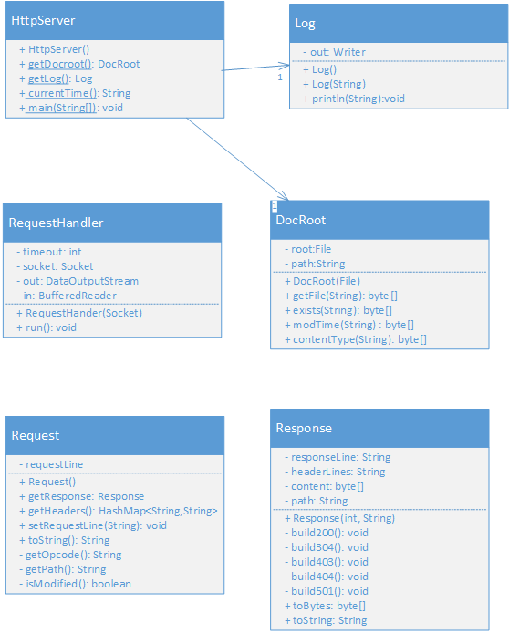

##CIS 457 Project 1: Mini HTTP Server

+ [Project Requirements](http://www.cis.gvsu.edu/~kalafuta/cis457/w15/labs/457prj1.html)
+ [Sample HTTP Exchange](#sample-http-exchange)
+ [How to Contribute](#how-to-contribute)
+ [Tips](#tips)

Class Diagram
----------



Sample HTTP Exchange
-----------------------

To retrieve the file at the URL

```
http://localhost/index.html:9876
```

first open a socket to localhost port 9876. Then, send something like the following through the socket:

```
GET /index.html HTTP/1.1\r\n
\r\n
```

The server should respond with something like the following, sent back through the same socket:

```
HTTP/1.0 200 OK\r\n
Date: Fri, 31 Dec 2009 23:59:59 GMT\r\n
Last-Modified: Sat, 28 Nov 2009 03:50:37 GMT\r\n
Content-Type: text/html\r\n
Content-Length: 1354\r\n
\r\n
<html>
<body>
<h1>Hello World!</h1>
(more file contents)
  .
  .
  .
</body>
</html>
```

How to Contribute
-------------------
1. Fork the main repository to your github account using the link in the upper right.
2. If you don't have git set up on your own computer, use a lab computer(ssh or physical). It's probably best to use a lab computer to compile.
3. Change into the directory you want the httpserver directory copied.
4. Clone the repository you forked in step 1 to the current directory. 

    ```
    $ git clone https://github.com/<your username>/httpserver.git
    ```
	- OR (This method requires you have ssh set up with your github account)
	
	```
    $ git clone git@github.com:<your username>/httpserver.git
    ```
	
	 - To verify:
	 
	  ```
       $ ls 
      ```
		- all project files should now be in your working directory
		
5. Add the main repository to your remote repositories. Call it whatever you want, but this document will refer to it as `upstream`.

    ```
    $ git remote add upstream https://github.com/cjnz457/httpserver.git
    ```
6. You should now have two remotes associated with the repository in your working directory: `upstream` and `origin`. `origin` is automatically created when you clone a repository. 
    - To verify: 

        ```
       $ git remote -v
        ```
		
		- `upstream` should be the URL to the main repository and `origin` should be the URL to your forked repository.
		
7. You're now ready to make changes. It's good practice to use a new [branch](http://nvie.com/posts/a-successful-git-branching-model/) for each new feature you're working on, or at least work on a branch separate from `master`. `master` should reflect the state of `upstream`.

    - To get a list of branches: (The current branch will be marked with an asterisk)

        ```
       $ git branch
        ```
    - To create a new branch:  

        ```
       $ git branch <branch name>
        ```
    - To switch branches:  

        ```
       $ git checkout <branch name>
        ```
    - To create a new branch and switch to it:  

        ```
       $ git checkout -b <branch name>
        ```

8. When you've completed a change, it's time to commit. 

    ```
    $ git commit -am "A short message that describes the change"
    ```
    - If you add a file, run this command first:
    
      ```
     $ git add --all
      ```
	  
9. When you've completed and tested a feature, you're ready to push it upstream. 

	1. Fetch any changes that may have been applied `upstream`. Merge `upstream`'s master branch into your local development branch, then resolve any conflicts (it will tell you if there are conflicts):
        
      ```
      $ git fetch upstream
      $ git merge upstream/master
      ```
    2. After a successful merge, push your local work up to your forked repository on github:
    
      ```
      $ git push  --all origin -u
      ```
		- The -u option makes it so that the next times you push, you only need to run `$ git push --all`
	  
	3. Now in github, create a pull request on the branch you just pushed. 

11. Once your pull request has been accepted and merged, you should switch to your master branch and fetch/merge from `upstream`.

    ```
    $ git checkout master
    $ git fetch upstream
    $ git merge upstream/master
    ```


## Tips
+ Don't forget to fetch/merge from `upstream` before you create a pull request.
